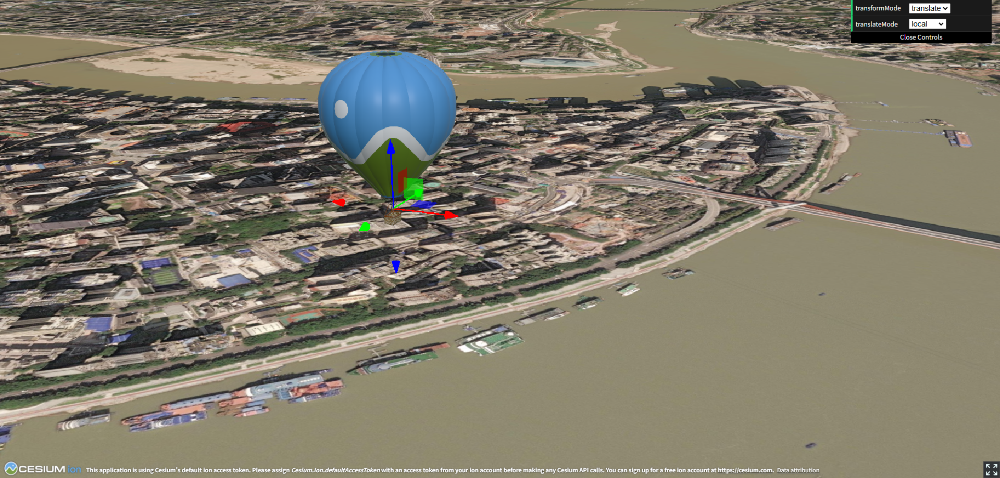

# Cesium Transform Controls

Cesium 3D 变换控制器，为 Cesium 实体和模型提供可视化的平移、旋转、缩放操作。



## 功能特性

### ✅ 已支持

- **Primitive 平移**
  - 本地坐标系模式（跟随物体自身旋转）
  - 地表坐标系模式（东-北-上）
  - 单轴平移（X/Y/Z）
  - 平面平移（XY/XZ/YZ）

- **Primitive 旋转**
  - 绕 X/Y/Z 轴旋转
  - 可视化辅助线

- **Primitive 缩放**
  - 单轴缩放
  - 平面缩放

- **Entity 平移**
  - 支持所有平移模式

### ⏳ 待扩展

- [ ] Entity 旋转支持
- [ ] Entity 缩放支持
- [ ] 多对象同时变换
- [ ] 吸附功能（网格吸附、角度吸附）
- [ ] 变换历史记录（撤销/重做）
- [ ] 自定义 Gizmo 样式和颜色

## 安装

```bash
npm install cesium-transform-controls
```

## 快速开始

### Primitive（模型）变换

```typescript
import * as Cesium from 'cesium'
import { Gizmo, GizmoMode, TranslateMode } from 'cesium-transform-controls'

const viewer = new Cesium.Viewer('cesiumContainer')

// 加载模型
const model = await Cesium.Model.fromGltfAsync({
  url: 'your-model.glb',
  modelMatrix: Cesium.Transforms.headingPitchRollToFixedFrame(
    Cesium.Cartesian3.fromDegrees(106, 29, 100),
    new Cesium.HeadingPitchRoll(0, 0, 0),
  ),
})
viewer.scene.primitives.add(model)

// 创建 Gizmo
const gizmo = new Gizmo()
gizmo.attach(viewer)
gizmo.mountToPrimitive(model, viewer)

// 设置模式
gizmo.setMode(GizmoMode.translate)  // 平移
gizmo.setMode(GizmoMode.rotate)     // 旋转
gizmo.setMode(GizmoMode.scale)      // 缩放
```

### Entity 变换（仅支持平移）

```typescript
const entity = viewer.entities.add({
  position: Cesium.Cartesian3.fromDegrees(106, 29, 100),
  box: {
    dimensions: new Cesium.Cartesian3(40, 30, 50),
    material: Cesium.Color.RED,
  },
})

const gizmo = new Gizmo()
gizmo.attach(viewer)
gizmo.mountToEntity(entity, viewer)
gizmo.setMode(GizmoMode.translate)
```

## 使用方式

### 方式一：代码控制挂载

直接在代码中指定要变换的对象：

```typescript
// 挂载到 Primitive
gizmo.mountToPrimitive(model, viewer)

// 或挂载到 Entity
gizmo.mountToEntity(entity, viewer)
```

### 方式二：鼠标点击选中

Gizmo 内置了鼠标点击选中功能，点击场景中的对象即可自动挂载：

```typescript
const gizmo = new Gizmo()
gizmo.attach(viewer)
// 不需要手动调用 mountToPrimitive/mountToEntity
// 直接点击场景中的 Primitive 或 Entity 即可自动挂载 Gizmo
```

点击场景中的对象时，Gizmo 会自动识别并挂载到该对象上。点击空白处可以取消选中。

## API

### Gizmo 类

#### 构造函数

```typescript
new Gizmo(options?: {
  onGizmoPointerDown?: (event: PointerEvent) => void
  onGizmoPointerUp?: (event: PointerEvent) => void
  onGizmoPointerMove?: (event: any) => void
})
```

#### 方法

| 方法 | 说明 |
|------|------|
| `attach(viewer)` | 附加到 Cesium Viewer |
| `detach()` | 从 Viewer 移除 |
| `mountToPrimitive(primitive, viewer)` | 挂载到 Primitive |
| `mountToEntity(entity, viewer)` | 挂载到 Entity |
| `setMode(mode)` | 设置变换模式 |

#### ⚠️ 重要说明

**销毁顺序**

在销毁 Viewer 前，必须先调用 `gizmo.detach()` 移除 Gizmo，否则可能导致错误：

```typescript
// ✅ 正确的销毁顺序
window.addEventListener('beforeunload', () => {
  gizmo.detach()      // 1. 先移除 Gizmo
  viewer.destroy()    // 2. 再销毁 Viewer
})

// ❌ 错误的顺序（会导致错误）
viewer.destroy()
gizmo.detach()  // 此时 viewer 已被销毁，会报错
```

**原因**：`gizmo.detach()` 需要访问 `viewer.scene.primitives` 来移除 Gizmo 的图形元素，如果 `viewer` 已经被销毁，会导致空引用错误。

#### 枚举

**GizmoMode** - 变换模式

```typescript
GizmoMode.translate  // 平移
GizmoMode.rotate     // 旋转
GizmoMode.scale      // 缩放
```

**TranslateMode** - 平移坐标系

```typescript
TranslateMode.local    // 本地坐标系
TranslateMode.surface  // 地表坐标系
```

## 运行示例

```bash
cd example
npm install
npm run dev
```

访问 `http://localhost:3000`

## 构建

```bash
npm install
npm run build
```

## 许可证

MIT
