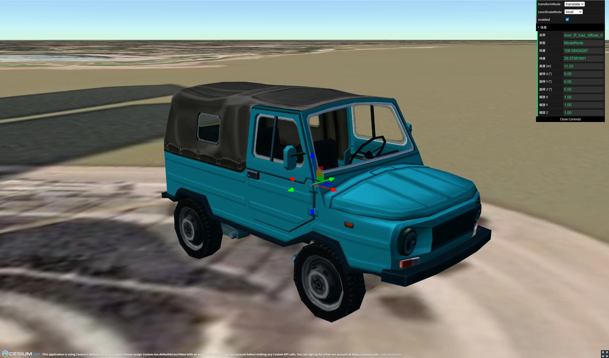

# Cesium Transform Controls

Cesium 3D 变换控制器，为 Cesium 实体和模型提供可视化的平移、旋转、缩放操作。

> 📚 **深入源码**：访问 [DeepWiki](https://deepwiki.com/123164867376464646/cesium-transform-controls) 查看本项目的 AI 深度代码解析与架构文档。



## 功能特性

### ✅ 已支持

- **Primitive 平移**
  - 本地坐标系模式（跟随物体自身旋转）
  - 地表坐标系模式（东-北-上）
  - 单轴平移（X/Y/Z）
  - 平面平移（XY/XZ/YZ）

- **Primitive 旋转**
  - 绕 X/Y/Z 轴旋转
  - 可视化辅助线

- **Primitive 缩放**
  - 单轴缩放
  - 平面缩放

- **Entity 平移**
  - 支持所有平移模式

- **包围盒可视化**
  - LocalBounds
  - WorldAABB

## 环境要求

- **Cesium**: 推荐 >= 1.121.0

## 安装

```bash
npm install cesium-transform-controls
```

## 快速开始

### Primitive（模型）变换

```typescript
import * as Cesium from 'cesium'
import { Gizmo, GizmoMode, CoordinateMode } from 'cesium-transform-controls'

const viewer = new Cesium.Viewer('cesiumContainer')

// 加载模型
const model = await Cesium.Model.fromGltfAsync({
  url: 'your-model.glb',
  modelMatrix: Cesium.Transforms.headingPitchRollToFixedFrame(
    Cesium.Cartesian3.fromDegrees(106, 29, 100),
    new Cesium.HeadingPitchRoll(0, 0, 0),
  ),
})
viewer.scene.primitives.add(model)

// 创建 Gizmo
const gizmo = new Gizmo()
gizmo.attach(viewer)
gizmo.mountToPrimitive(model, viewer) //手动绑定模型

// 设置模式
gizmo.setMode(GizmoMode.translate)  // 平移
gizmo.setMode(GizmoMode.rotate)     // 旋转
gizmo.setMode(GizmoMode.scale)      // 缩放
```

### Entity 变换（仅支持平移）

```typescript
const entity = viewer.entities.add({
  position: Cesium.Cartesian3.fromDegrees(106, 29, 100),
  box: {
    dimensions: new Cesium.Cartesian3(40, 30, 50),
    material: Cesium.Color.RED,
  },
})

const gizmo = new Gizmo()
gizmo.attach(viewer)
gizmo.mountToEntity(entity, viewer)
gizmo.setMode(GizmoMode.translate)
```

## 使用方式

### 方式一：代码控制挂载

直接在代码中指定要变换的对象：

```typescript
// 挂载到 Primitive
gizmo.mountToPrimitive(model, viewer)

// 或挂载到 Entity
gizmo.mountToEntity(entity, viewer)

// 或挂在到模型的某个子模型
gizmo.mountToNode(node, model, viewer)
```

> [!WARNING]
> **关于模型子节点的获取**
>
> 与 Three.js 不同（Three.js 加载 glTF 后直接生成 Mesh 树，可直接拾取任意 Mesh），Cesium 为了性能优化，默认将 glTF 视为一个整体图元（`Primitive`）。
>
> **若需要控制子节点，必须在建模阶段（如 Blender）确保部件是独立的 Object/Node，切勿将网格合并（Merge/Join）。** 只有保留了独立的节点层级，Cesium 才能通过 `model.getNode()` 识别并操作它们。

### 方式二：鼠标点击选中

Gizmo 内置了鼠标点击选中功能，点击场景中的对象即可自动挂载：

```typescript
const gizmo = new Gizmo()
gizmo.attach(viewer)
// 不需要手动调用 mountToPrimitive/mountToEntity/mountToNode
// 直接点击场景中的 Primitive、Entity 或 ModelNode 即可自动挂载 Gizmo
```

点击场景中的对象时，Gizmo 会自动识别并挂载到该对象上。**支持点击模型的子节点，将自动挂载到对应节点**。点击空白处可以取消选中。

### 方式三:三层控制机制

Gizmo 提供了三个不同层级的控制方式:

```typescript
const gizmo = new Gizmo()

// 1️⃣ 创建/销毁 - 资源层面
gizmo.attach(viewer)    // 将 Gizmo 添加到场景
gizmo.detach()          // 从场景中完全移除

// 2️⃣ 显示/隐藏 - 视觉层面
gizmo._transPrimitives._show = true   // 显示 Gizmo
gizmo._transPrimitives._show = false  // 隐藏 Gizmo（不参与渲染）

// 3️⃣ 启用/禁用 - 交互层面
gizmo.setEnabled(true)   // 启用交互（可见且可操作）
gizmo.setEnabled(false)  // 禁用交互（可见但不响应鼠标事件）
```

**使用场景：**

- `attach/detach`: 完整的生命周期管理，适合创建和销毁时使用
- `show`: 临时隐藏 Gizmo，但保持其在场景中，适合需要快速显示/隐藏的场景
- `setEnabled`: 显示 Gizmo 作为视觉提示，但禁止用户操作，适合锁定对象、只读模式等场景

## API

### Gizmo 类

#### 构造函数

```typescript
new Gizmo(options?: {
  onGizmoPointerDown?: (event: GizmoPointerDownEvent) => void
  onGizmoPointerUp?: (event: GizmoPointerUpEvent) => void
  onGizmoPointerMove?: (event: GizmoPointerMoveEvent) => void
  /** 
   * 是否使用左键触发操作（默认 true）
   * 即默认点击左键触发节点绑定操作 
   */
  isLeftClick?: boolean
})
```

#### 方法

| 方法 | 说明 |
|------|------|
| `attach(viewer)` | 附加到 Cesium Viewer |
| `detach()` | 从 Viewer 移除 |
| `mountToPrimitive(primitive, viewer)` | 挂载到 Primitive |
| `mountToEntity(entity, viewer)` | 挂载到 Entity |
| `mountToNode(node, model, viewer)` | 挂载到模型的子节点（ModelNode） |
| `setMode(mode)` | 设置变换模式 |
| `setEnabled(enabled)` | 设置启用/禁用状态 |

#### ⚠️ 重要说明

**销毁顺序**

在销毁 Viewer 前，必须先调用 `gizmo.detach()` 移除 Gizmo，否则可能导致错误：

```typescript
// ✅ 正确的销毁顺序
window.addEventListener('beforeunload', () => {
  gizmo.detach()      // 1. 先移除 Gizmo
  viewer.destroy()    // 2. 再销毁 Viewer
})

// ❌ 错误的顺序（会导致错误）
viewer.destroy()
gizmo.detach()  // 此时 viewer 已被销毁，会报错
```

**原因**：`gizmo.detach()` 需要访问 `viewer.scene.primitives` 来移除 Gizmo 的图形元素，如果 `viewer` 已经被销毁，会导致空引用错误。

#### 枚举

**GizmoMode** - 变换模式

```typescript
GizmoMode.translate  // 平移
GizmoMode.rotate     // 旋转
GizmoMode.scale      // 缩放
```

**CoordinateMode** - 坐标系模式

```typescript
CoordinateMode.local    // 本地坐标系
CoordinateMode.surface  // 地表坐标系
```

## 运行示例

```bash
cd example
npm install
npm run dev
```

访问 `http://localhost:3000`

## 构建

```bash
npm install
npm run build
```

## 许可证

MIT
